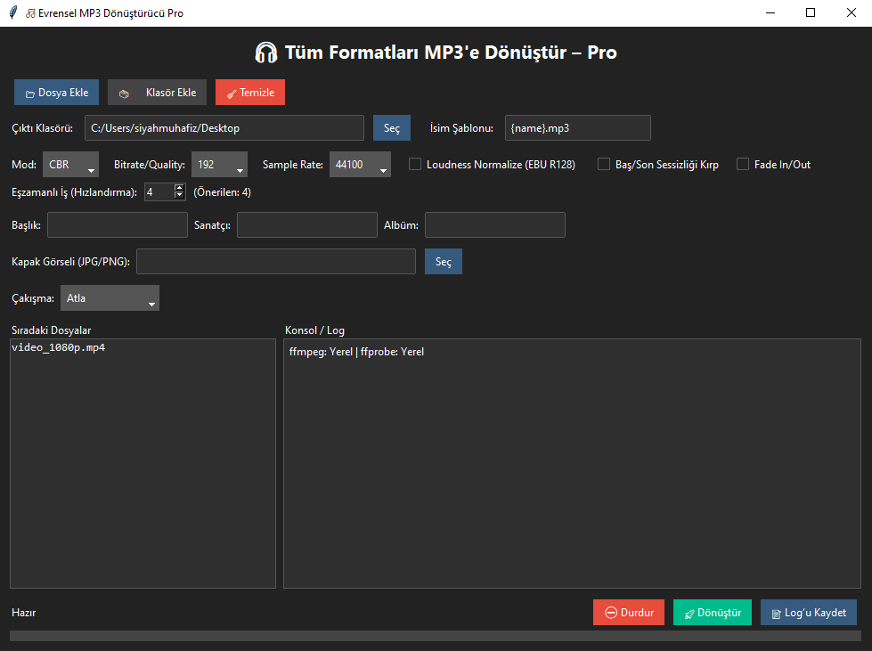

# 🎵 EBS MP3 Converter Pro

Minimal zahmet, maksimum hız! **EBS MP3 Converter Pro**, video ve ses dosyalarını tek tıkla **yüksek hızlı** ve **toplu** şekilde **MP3**’e dönüştürmenizi sağlayan, şık arayüzlü (TTKBootstrap) bir masaüstü uygulamasıdır.  
Sürükle-bırak, sağ tık menüsü, kapak görseli gömme, sessizlik kırpma, fade in/out ve çok çekirdekli paralel dönüştürme ile “pro” deneyimi yaşatır. 🚀
---
Program Ekran Görüntüsü


---

## ✨ Neden EBS MP3 Converter Pro?

- ⚡ **Çok hızlı**: Çok çekirdekli **paralel dönüştürme** ile aynı anda birden çok dosyayı işler.  
- 🖼️ **Kapak gömme (attached_pic)**: MP3’lere **albüm kapağı** (mjpeg) güvenli şekilde ekler.  
- ✂️ **Sessizliği otomatik kırpar**: Baş/son sessizlikleri akıllı biçimde temizler.  
- 🎚️ **Fade in/out**: Yumuşak giriş/çıkış efektleri.  
- 🎛️ **CBR / VBR**: LAME üzerinden sabit bitrate veya kalite odaklı VBR çıkış.  
- 🧰 **Kullanışlı GUI**: Sürükle-bırak, sağ tık menüsü (Klasörde aç / Listeden kaldır), log kaydı, ilerleme çubuğu.  
- 🧠 **Ayarları hatırlar**: Son çıktı klasörünü, şablonları ve seçenekleri otomatik kaydeder.  
- 🧩 **Esnek**: Sample rate seçimi, meta veri (başlık/sanatçı/albüm), isim şablonu `{name}`, `{bitrate}`, `{mode}`.

---

## 📦 Bağımlılıklar

**Zorunlu**
- 🐍 **Python** 3.10+  
- 🎞️ **FFmpeg** ve **FFprobe** (PATH’te olmalı veya exe’ler uygulama yanında bulunmalı)
- 🎨 **ttkbootstrap**

**Opsiyonel**
- 🖱️ **tkinterdnd2** (sürükle-bırak için)

**Kurulum**
```bash
pip install ttkbootstrap tkinterdnd2
```

> FFmpeg kurulumu:  
> - Windows: https://www.gyan.dev/ffmpeg/builds/  
> - macOS: `brew install ffmpeg`  
> - Linux: `sudo apt-get install ffmpeg`

---

## 🚀 Hızlı Başlangıç

```bash
git clone https://github.com/ebubekirbastama/EBS-MP3-Converter-Pro.git
cd EBS-MP3-Converter-Pro
python EBS-Converter.py
```

---

## 🧭 Kullanım

1. Dosya veya klasör ekleyin (sürükle-bırak da desteklenir).  
2. Çıktı klasörünü ve isim şablonunu belirleyin.  
3. Mod (CBR/VBR), Bitrate, Sample Rate seçin.  
4. Opsiyonel: Loudness normalize, Sessizliği kırp, Fade in/out, Kapak görseli.  
5. Eşzamanlı iş sayısını belirleyin.  
6. Dönüştür’e tıklayın.  
7. Log’u kaydedebilir, dosyaları sağ tık menüsüyle yönetebilirsiniz.

---

## 📈 Performans İpuçları

- VBR (q4–q5) genellikle hızlı ve kaliteli.  
- Loudness normalize kalite katar ama süreci yavaşlatır.  
- Eşzamanlı iş sayısını CPU çekirdeği kadar yapın.  
- MP3 → MP3 dönüştürmelerde yeniden kodlama yapılmaz, sadece kopyalanır.

---

## 🧩 Artılar

✅ Modern GUI (TTKBootstrap)  
✅ Sürükle-bırak + Sağ tık menüsü  
✅ Ayarları otomatik kaydeder  
✅ Paralel (multi-threaded) dönüştürme  
✅ Kapak görseli ve meta veri desteği  
✅ Sessizlik kırpma, Fade in/out filtreleri


---

## 🛟 Sorun Giderme

- FFmpeg bulunamadı → PATH kontrolü veya exe aynı klasörde.  
- Sürükle-bırak çalışmıyor → `pip install tkinterdnd2`.  
- Kapak gömülmedi → Görsel yolu ve formatı (JPG/PNG) kontrol edin.  

---

## 🤝 Katkı

Yıldız ⭐ vererek projeye destek olabilirsiniz!


